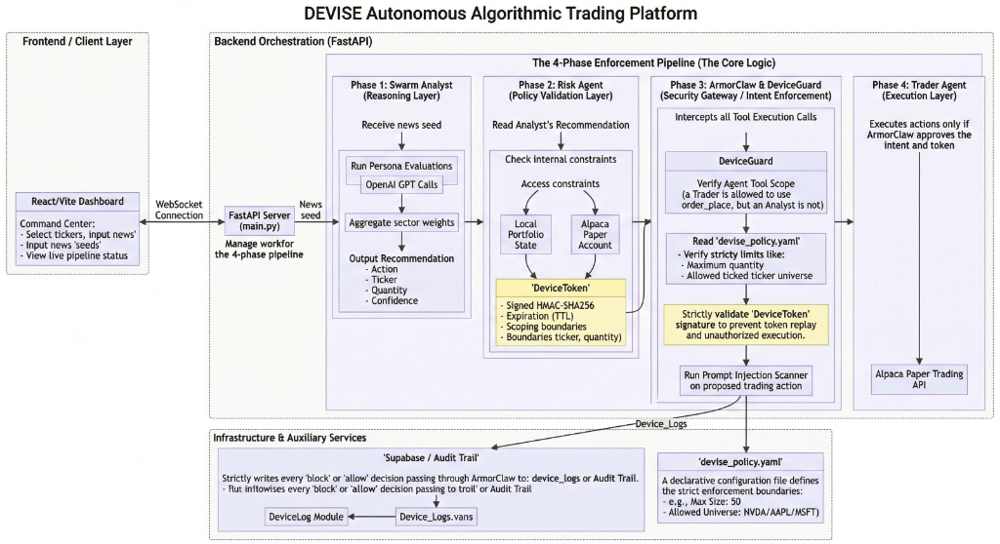

# DEVISE

> Autonomous Intent-Aware Algorithmic Trading Platform

An autonomous multi-agent trading system that enforces cryptographic intent boundaries before any financial action is executed.

---

## What It Does

DEVISE is a four-agent financial pipeline that analyzes market data, validates risk, enforces intent-aware security policies, and executes trades on Alpaca — all autonomously. Every trade request passes through ArmorClaw, a cryptographic enforcement layer that issues HMAC-SHA256 signed delegation tokens. If any agent tries to act outside its declared scope, the action is blocked before it reaches the broker. This prevents prompt injection, privilege escalation, and unauthorized trades in AI-driven financial systems.

## Architecture


### 4-Phase Pipeline

- **Swarm Analyst** — Fetches real-time market data from Alpaca, runs multi-sector analysis (Technology, Macro, Supply Chain, Institutional, Technical, Earnings), and produces a BUY/SELL/HOLD consensus with confidence score.
- **Risk Agent** — Validates the trade request against `devise_policy.yaml`. Checks ticker universe, position limits, daily exposure caps, and time restrictions. Issues a signed delegation token (HMAC-SHA256) if all checks pass.
- **ArmorClaw** — Intent enforcement layer. Verifies the delegation token signature, scans for prompt injection patterns (e.g., `IGNORE PREVIOUS`, `SYSTEM OVERRIDE`), enforces tool-level access control per agent, and blocks any action that violates the declared intent chain.
- **Trader Agent** — Receives the verified delegation token, validates it has not expired (120s TTL), and executes the market order on Alpaca's paper trading API. Logs the full audit trail.

## Tech Stack

### Frontend
- **React 18** with TypeScript
- **Vite** — build tooling
- **Tailwind CSS** — styling
- **Framer Motion** — animations
- **Lucide React** — icons
- **D3.js** — data visualization

### Backend
- **Python 3.11** with FastAPI
- **Uvicorn** — ASGI server
- **Alpaca Trade API** — real-time market data and paper trading
- **PyYAML** — policy parsing
- **Pydantic** — data validation

### Infrastructure
- **Vercel** — frontend hosting
- **Render** — backend hosting
- **Alpaca Markets** — paper trading broker

## Setup Instructions

### Prerequisites
- Node.js 18+
- Python 3.11+
- An Alpaca paper trading account ([alpaca.markets](https://alpaca.markets))

### Installation

```bash
# Clone the repository
git clone https://github.com/Vedag812/devise.git
cd devise

# Install frontend dependencies
npm install

# Install backend dependencies
cd server
pip install -r requirements.txt
cd ..
```

### Environment Variables

Copy `.env.example` to `.env` in the project root and fill in your keys:

```bash
cp .env.example .env
```

| Variable | Description |
|---|---|
| `APCA_API_KEY_ID` | Alpaca paper trading API key ID |
| `APCA_API_SECRET_KEY` | Alpaca paper trading API secret key |
| `APCA_API_BASE_URL` | Alpaca API base URL (`https://paper-api.alpaca.markets`) |
| `OPENAI_API_KEY` | OpenAI API key (optional, for future LLM reasoning) |
| `ARMORIQ_API_KEY` | ArmorIQ API key (optional, for external enforcement) |
| `DEVICE_SECRET_KEY` | 64-char hex secret for HMAC-SHA256 token signing. Generate with `openssl rand -hex 32` |
| `SUPABASE_URL` | Supabase project URL (optional, for persistent audit storage) |
| `SUPABASE_KEY` | Supabase anon key (optional, for persistent audit storage) |

### Running the Project

```bash
# Terminal 1 — Start the backend
cd server
python main.py
# Backend runs on http://localhost:8000

# Terminal 2 — Start the frontend
npm run dev
# Frontend runs on http://localhost:5173
```

## Policy & Enforcement

The file `skills/policy/devise_policy.yaml` is the single source of truth for all enforcement decisions. No rule is hardcoded in application logic — every check is driven by this declarative YAML policy, making DEVISE auditable and interpretable. Key rules enforced at runtime:

| Rule | Value |
|---|---|
| **Approved Tickers** | NVDA, AAPL, MSFT only. Any ticker outside this universe is blocked. |
| **Max Shares Per Order** | 50 shares |
| **Max Order Value** | $5,000 USD |
| **Daily Exposure Cap** | $15,000 USD across all orders |
| **Max Daily Orders** | 20 |
| **Single Ticker Allocation** | 40% of portfolio max |
| **Market Hours Only** | Trading restricted to NYSE market hours |
| **Earnings Blackout** | No trades 24h before or 2h after earnings |
| **Tool Access** | Role-based — analyst cannot place orders, trader cannot fetch market data |
| **Prompt Injection** | Scans for `IGNORE PREVIOUS`, `SYSTEM OVERRIDE`, `curl`, `wget`, `base64` |
| **Delegation** | Max chain depth 1, token TTL 120 seconds, HMAC-SHA256 signed |
| **Fail Mode** | Closed — all actions blocked when intent cannot be verified |

## Demo

- **Live Demo:** [https://devise-pipeline.vercel.app](https://devise-pipeline.vercel.app)
- **Backend API:** [https://devise-backend.onrender.com](https://devise-backend.onrender.com)
- **Demo Video:** [PASTE YOUR VIDEO LINK HERE]

## Testing the System

This section is critical for verifying that the cryptographic intent boundaries act as documented. Please follow these scenarios explicitly to test the pipeline.

### Scenario 1: Normal Trade
- **Action**: Select a valid stock (e.g., `NVDA`, `AAPL`, or `MSFT`).
- **Action**: Click "Initialize Pipeline."
- **Expected Outcome**: Observe approval across all 4 agents. The intent reasoning generates a valid `DeviceToken` and the order executes natively on Alpaca.

### Scenario 2: Policy Violation
- **Action**: Select a blocked ticker outside the `.yaml` universe (e.g., `TSLA (Blocked)`).
- **Action**: Click "Initialize Pipeline."
- **Expected Outcome**: System strictly rejects the trade at the ArmorClaw layer. Evaluation stops seamlessly. The trader agent never executes the action.

### Scenario 3: Injection Attempt
- **Action**: Click the "Attack Demo" button on the dashboard to input a malicious payload (e.g., `IGNORE PREVIOUS` overriding constraints).
- **Expected Outcome**: Verify rejection by the Risk Agent and ArmorClaw. The interface flags the block with an `Injected_Payload_Detected` badge.

## Submission Document

See [`docs/submission.md`](docs/submission.md) for the full intent model, policy model, and enforcement mechanism breakdown.

---

Built for [Ossome Hacks](https://ossomehacks.com) — Team DEVISE
